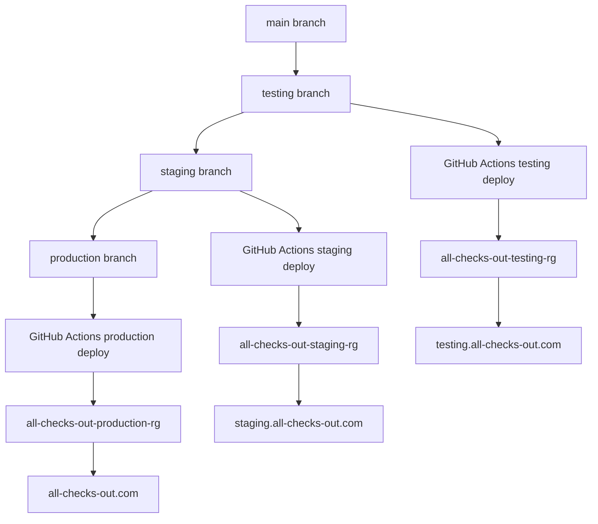

# DevOps Operations

This repository uses simple branch promotion, Azure resource groups, Bicep, shell scripts, pnpm, and GitHub Actions.

Run all commands from the repository root.

## Branch Strategy

The permanent branches are:

| Branch | Purpose |
| --- | --- |
| `main` | Active development |
| `testing` | Testing deployment |
| `staging` | Product owner review |
| `production` | Public release |

Promotions only move in this direction:

```text
main
  |
  v
testing
  |
  v
staging
  |
  v
production
```

Feature branches and `main` do not deploy automatically. GitHub Actions deploys only when `testing`, `staging`, or `production` receives a push.

## Repository Bootstrap

When a course repository is copied into a new folder, initialise or repair the course branches from the repository root:

```bash
pnpm run repo:init
```

If Git is not initialised yet, the command:

1. Initialises Git.
2. Creates the `main` branch.
3. Creates the first commit.
4. Creates `testing`.
5. Creates `staging`.
6. Creates `production`.

If Git already exists, the command checks for:

```text
main
testing
staging
production
```

Existing branches are skipped. Missing branches are created from `main`.

If `origin` is configured, the command pushes all four branches. Existing published branches are updated normally by Git. Missing published branches are created.

To add a GitHub remote and push all four branches:

```bash
pnpm run repo:init <github-url>
```

## Release Process

Promote to testing:

```bash
pnpm run release:testing
```

This fast-forwards `testing` from `main`, pushes `testing`, and triggers the testing deployment.

Promote to staging:

```bash
pnpm run release:staging
```

This fast-forwards `staging` from `testing`, pushes `staging`, and triggers the staging deployment.

Promote to production:

```bash
pnpm run release:production
```

This fast-forwards `production` from `staging`, pushes `production`, and triggers the production deployment.

## Environment Architecture

Each environment has its own resource group, storage account, static website endpoint, and configuration file.

| Environment | Branch | Resource group | Public URL | Config file |
| --- | --- | --- | --- | --- |
| Testing | `testing` | `all-checks-out-testing-rg` | `https://testing.all-checks-out.com` | `environments/testing.json` |
| Staging | `staging` | `all-checks-out-staging-rg` | `https://staging.all-checks-out.com` | `environments/staging.json` |
| Production | `production` | `all-checks-out-production-rg` | `https://all-checks-out.com` | `environments/production.json` |



## Local Deployment

Deploy testing:

```bash
pnpm run deploy:testing
```

Deploy staging:

```bash
pnpm run deploy:staging
```

Deploy production:

```bash
pnpm run deploy:production
```

Each deployment:

1. Creates or updates the resource group.
2. Deploys `infra/main.bicep`.
3. Enables Azure Storage static website hosting.
4. Builds the UI.
5. Uploads `apps/ui/dist` to the `$web` container.
6. Prints the Azure static website endpoint and the public environment URL.

## What-If

Preview infrastructure changes:

```bash
pnpm run whatif:testing
pnpm run whatif:staging
pnpm run whatif:production
```

## GitHub Actions Deployment

The workflow is defined in `.github/workflows/deploy.yml`.

It runs on pushes to:

- `testing`
- `staging`
- `production`

It does not run on `main`.

The workflow requires one GitHub Actions secret:

```text
AZURE_CREDENTIALS
```

Create it from an Azure service principal JSON value compatible with `azure/login@v2`.

## Destroy Process

Destroy testing:

```bash
pnpm run destroy:testing
```

Destroy staging:

```bash
pnpm run destroy:staging
```

Destroy production:

```bash
pnpm run destroy:production
```

Production deletion requires this exact confirmation:

```text
DELETE-PRODUCTION
```

## DNS

Cloudflare remains the DNS provider.

After deploying each environment, run the matching deployment command and copy the printed Azure static website endpoint. Use the endpoint host as the Cloudflare CNAME target.

| Record | Type | Target | Proxy status | SSL/TLS |
| --- | --- | --- | --- | --- |
| `testing.all-checks-out.com` | `CNAME` | Testing Azure static website host, for example `allcheckouttest...web.core.windows.net` | Proxied | Cloudflare SSL/TLS enabled |
| `staging.all-checks-out.com` | `CNAME` | Staging Azure static website host, for example `allcheckoutstage...web.core.windows.net` | Proxied | Cloudflare SSL/TLS enabled |
| `all-checks-out.com` | `CNAME` or Cloudflare CNAME flattening | Production Azure static website host, for example `allcheckoutprod...web.core.windows.net` | Proxied | Cloudflare SSL/TLS enabled |

Recommended Cloudflare settings:

- Proxy status: `Proxied`
- SSL/TLS encryption mode: `Full`
- Always Use HTTPS: enabled
- Automatic HTTPS Rewrites: enabled

## HTTPS

All public URLs must be HTTPS:

```text
https://testing.all-checks-out.com
https://staging.all-checks-out.com
https://all-checks-out.com
```

Azure Storage provides the static website origin endpoint. Cloudflare provides HTTPS for the custom domains when the records are proxied and SSL/TLS is enabled.

Manual steps:

1. Deploy each environment once.
2. Copy each Azure static website host from `pnpm run ui:url` or the deployment output.
3. Create the Cloudflare DNS records.
4. Enable the Cloudflare HTTPS settings above.
